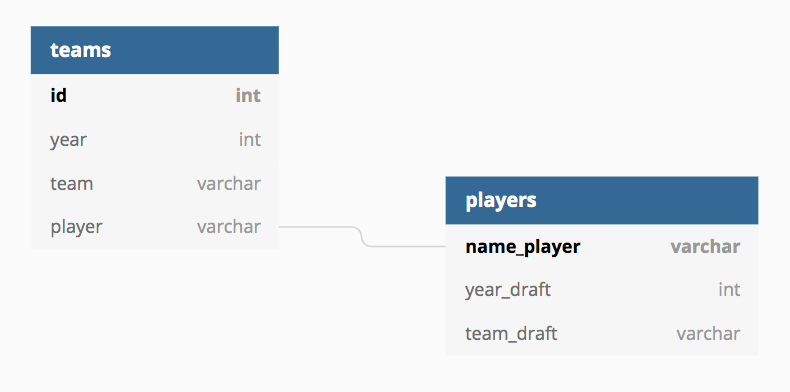

# Scraping project: basketball_reference.com
## Moneyball movie, but for Basketball

We scrap data about basketball <strong>players</strong> and <strong>teams</strong>, since basketball became a thing.

In the long run, this project could make it possible to apply data science to predict the value of a player based on his performances and assess how likely he is to become one of the most valuable players.

### Usage

python webscraping.py --start [arg start_year] --end [arg end_year]

### Tables

### Authors & acknowledgement

Big up to you guys for taking the time to correct us and give us feedback

 