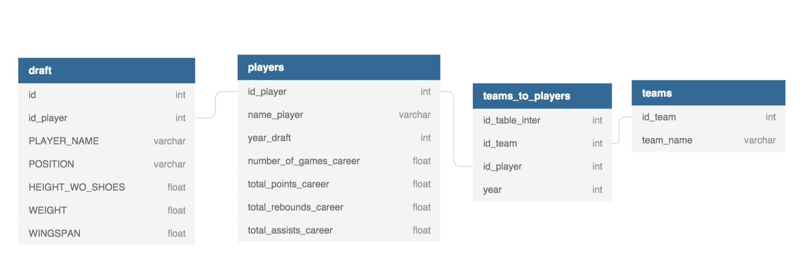

# Scraping project: basketball_reference.com
## We're about to achieve the Moneyball movie, but for Basketball

We scrap data about basketball <strong>players</strong>, <strong>team constitution over the years and by team </strong>
 <strong> and drafts by year</strong>.

In the long run, this project could make it possible to apply data scienceto predict the value of a player
based on his performances and assess how likely he is to become one of the most valuable players.

### Usage

To scrap data about players:

<nano> <strong>python players_scrap.py --start [arg start_letter] --end [arg end_letter]</strong></nano>

This code makes it possible to scrap data about players whose last name is between start_letter ('a' by default)
and end_letter ('z' by default)

This command automatically adds in the <strong>teams</strong> table the list of teams (one row = one team)

This command also creates the intermediary table <strong>teams_to_plapy yers</strong>
that gives for each player his previous NBA teams and the corresponding year

<strong>NBA API:</strong>: when you scrap a player, our API puts in a separate table 
the drafts information of this player in a separate table

<h3>WARNING: in order to quickly test the project,
I suggest you enter the following command to scrap only players whose last name starts with a Z:
<nano>python players_scrap.py --start z --end z</nano></h3>

### Installation

Run following command:

<nano>pip install -r requirements.txt</nano>

To use the API:

<nano>pip install nba_api</nano>

### Tables

### Authors & acknowledgement

Thanks to you guys for taking the time to correct us and give us feedback

